<!-- ══════════════════════════════════════════════════════════════
     Somesh Bhardwaj — GitHub Profile README (Final)
     Design: Emerald Terminal · #10B981 + #F59E0B · #064E3B
     ══════════════════════════════════════════════════════════════ -->


<h3 align="center">AI Solutions Architect &nbsp;·&nbsp; Systems Integrator &nbsp;·&nbsp; Automation Engineer</h3>

<p align="center">
  
</p>

<p align="center">
  
  
  
  
  
</p>

<p align="center">
  <a href="https://someshbhardwaj.dev">
    
  </a>
  <a href="https://www.linkedin.com/in/ersomeshbhardwaj/">
    
  </a>
  <a href="mailto:hello@someshbhardwaj.dev">
    
  </a>
  <a href="mailto:ITDeveloper06@gmail.com">
    
  </a>
  <a href="https://github.com/Dev-Somesh">
    
  </a>
</p>

<p align="center">
  
  
  
</p>

---

## `$ cat about.md`

> I build intelligent systems that scale operations — sitting at the intersection of IT infrastructure, workflow automation, AI integration, and product engineering. My edge is seeing how disconnected platforms, manual processes, and data silos can be fused into one cohesive, automated, AI-augmented system.

> From administering 250+ enterprise SaaS apps to shipping AI-native products, I don't just manage tools or write code — I design, integrate, automate, and operate complex digital ecosystems. Rarely a single title covers this; that's by design.

<table>
<tr>
<td width="55%" valign="top">

```bash
$ whoami
  Somesh Bhardwaj

$ cat profile.json
{
  "role":      "AI Solutions Architect & Systems Integrator",
  "company":   "Contentment Foundation · Feb 2021–Present",
  "education": "B.Tech, Computer Science · 2012",
  "domain":    "IT Ops | Automation | AI | Platform Eng",
  "managing":  "250+ enterprise SaaS apps",
  "stack":     ["Make","Playwright","React","TypeScript",
                "OpenAI","Supabase","n8n","Slack APIs"],
  "open_to":   ["AI Automation Engineer",
                "Tech Operations Architect",
                "AI Product Engineer",
                "Systems Integration Lead"]
}
```

</td>
<td width="45%" valign="top">

<br/>

**By the numbers**


<br/>

> *"Automate the mundane. Amplify the human."*

Complexity should bow to clarity — whether that's a Make workflow that replaces a Friday afternoon, or an AI product that turns chaos into calm.

</td>
</tr>
</table>

---

## `$ git log --career`

```
2012 ─── 🎓 B.Tech, Computer Science · entered the tech field
          └─ Engineering foundations · development · systems · QA

2012–2021 ── 🔧 Cross-domain tech work · projects & roles
          └─ Test automation · product thinking · systems integration

2021 ─── 🏢 Contentment Foundation (Feb) · platform ops & IT admin
          └─ Google Workspace · Okta · SaaS lifecycle · onboarding SOPs

2022 ─── ⚙️  Deep automation phase · scripting & workflow pipelines
          ├─ Playwright · Make · n8n · Zapier · Google Apps Script
          └─ Power BI · Tableau · GAT+ data dashboards

2024 ─── 🤖 AI integration & product engineering
          ├─ CarbonWise · CoachSophia · AI Civic Issue Reporter · shipped
          └─ Mindful Assistant · WIP · daily focus + wellbeing AI

2026 ─── 🚀 Scaling with intelligence
          ├─ Chrome extensions · Google Workspace add-ons
          ├─ AI-augmented IT ops (Make + OpenAI + Slack)
          └─ AI × mindfulness · GenAI UX patterns
```

---

## `$ ls skills/ --by-category`

### Languages & Web
<p align="center">
  
</p>

### Cloud, DevOps & Platform
<p align="center">
  
</p>

<br/>

<details>
<summary><b>🔧 Systems Administration — expand</b></summary><br/>


User provisioning · SSO & MFA · SaaS license audits · onboarding/offboarding SOPs · compliance frameworks · asset management · 250+ apps
</details>

<details>
<summary><b>⚙️ Automation & Workflow Engineering — expand</b></summary><br/>


Cross-tool workflow pipelines · browser automation · regression testing · scheduled jobs · API integrations · event-driven logic
</details>

<details>
<summary><b>🤖 AI & LLM Integration — expand</b></summary><br/>


Prompt engineering · AI agent frameworks · AI UX design · LLM workflow orchestration · AI-assisted development · AI-native product building
</details>

<details>
<summary><b>📊 Analytics & Reporting — expand</b></summary><br/>


IT cost dashboards · SaaS usage analytics · GAT+ audits · KPI tracking · data-driven operational decisions
</details>

<p align="center">
  
  
  
  
  
  
  
  
</p>

---

## `$ cat expertise.table`

| Domain | Proficiency | Details |
|--------|-------------|---------|
| **IT Operations & SaaS Admin** | `████████████` Expert | 250+ apps · Okta · Google Workspace · BambooHR · Zoom · Slack |
| **Systems Integration** | `████████████` Expert | 20+ platforms · Slack · Jira · GitHub · Stripe · Supabase · DNS |
| **Workflow Automation** | `████████████` Expert | Make · n8n · Apps Script · Playwright · Webhooks · Slack Bots |
| **AI Adoption & Engineering** | `█████████░░` Advanced | OpenAI APIs · Claude · Cursor · agent frameworks · AI UX design |
| **Analytics & BI** | `████████░░░` Strong | Power BI · Tableau · GA4 · GTM · Microsoft Clarity |
| **Web & Platform Engineering** | `████████░░░` Strong | React · TypeScript · Tailwind · Next.js · Netlify · Vercel |
| **Product & Systems Thinking** | `████████░░░` Strong | UX design · MVP scoping · onboarding architecture · PRDs |
| **Technical Documentation** | `████████████` Expert | SOPs · PRDs · OKRs · architecture diagrams · QA docs |

---

## `$ gh repo list --featured --sort=commits`

> Your **most-built repositories** ranked by commit activity — public repos are clickable · private repos shown as profile cards (case-study walkthrough on request)

<p align="center">
  
  
  
</p>

| # | Repository | Commits | | Language | What it is |
|:-:|------------|:-------:|:-:|----------|------------|
| 1 | `FlourishOS-Archive` | **282** | 🔒 | TypeScript | **Event Pro** — Contentment Foundation event & engagement platform |
| 2 | [**adhirachna**](https://github.com/Dev-Somesh/adhirachna) | **208** | 🌐 | TypeScript | React app — auth, blog, admin dashboard, Supabase + Contentful |
| 3 | `curryosity-by-seeds-of-life` | **100** | 🔒 | TypeScript | Official **Curryosity Card Games** website — SEO, interactive UX |
| 4 | `someshbhardwajdev` | **99** | 🔒 | TypeScript | **[someshbhardwaj.dev](https://someshbhardwaj.dev)** — AI-powered portfolio site |
| 5 | `Somesh-Bhardwaj-Portfolio-Ai-Chatbot` | **92** | 🔒 | TypeScript | Portfolio + **Gemini AI chatbot** integration |
| 6 | [**justflow**](https://github.com/Dev-Somesh/justflow) | **79** | 🌐 | TypeScript | Workflow automation & PM — visual builders, monitoring, integrations |
| 7 | `aiokr` | **79** | 🔒 | TypeScript | OKR tracking & goal-management platform |
| 8 | [**Dev-Wrapped**](https://github.com/Dev-Somesh/Dev-Wrapped) | **69** | 🌐 | TypeScript | Developer **year wrapped** — your GitHub story in a calendar year |
| 9 | `conference_dossier` | **49** | 🔒 | TypeScript | Conference dossier & event content platform |
| 10 | [**forge-studio-4K-FHD**](https://github.com/Dev-Somesh/forge-studio-4K-FHD) | **44** | 🌐 | TypeScript | AI-powered FHD/4K wallpaper engine |
| 11 | `mindful-focusmate` | **19** | 🔒 | TypeScript | **Mindful Assistant** — AI focus, reflection & wellbeing |
| 12 | [**CarbonWise_Coach**](https://github.com/Dev-Somesh/CarbonWise_Coach) | **13** | 🌐 | TypeScript | AI sustainability coaching — carbon footprint tracking |
| 13 | `AI_civic_issue_reporting` | **13** | 🔒 | Python | **AI Civic Issue Reporter** — community issue reporting |

<br/>

### Top showcase — repo cards

<table>
<tr>
<td width="50%" valign="top">

#### 🔒 `FlourishOS-Archive` · **282 commits**


> **Event Pro** by Contentment Foundation — full event management, engagement dashboards, and org-wide event operations. *My most-committed repository.*

`Stack` TypeScript · React · Supabase · Slack APIs

</td>
<td width="50%" valign="top">

#### 🌐 [adhirachna](https://github.com/Dev-Somesh/adhirachna) · **208 commits**


> Modern full-stack web app — authentication, blog system, user management, analytics, and admin dashboard.

`Stack` React · TypeScript · Supabase · Contentful · Netlify

</td>
</tr>
<tr>
<td width="50%" valign="top">

#### 🔒 `curryosity-by-seeds-of-life` · **100 commits**


> Official website for **Curryosity Card Games** — interactive, SEO-optimized React site for Seeds of Life Creations.

`Stack` TypeScript · React · Tailwind · Netlify

</td>
<td width="50%" valign="top">

#### 🔒 `someshbhardwajdev` · **99 commits**


> Source for **[someshbhardwaj.dev](https://someshbhardwaj.dev)** — AI-powered portfolio with modern dark-theme UX.

`Stack` TypeScript · React · Framer Motion · AI chat

</td>
</tr>
<tr>
<td width="50%" valign="top">

#### 🔒 `Somesh-Bhardwaj-Portfolio-Ai-Chatbot` · **92 commits**


> Portfolio with integrated **Gemini 3.0 chatbot** — interactive case studies and conversational navigation.

`Stack` TypeScript · React · Gemini API

</td>
<td width="50%" valign="top">

#### 🌐 [justflow](https://github.com/Dev-Somesh/justflow) · **79 commits**


> Workflow automation & project management — visual workflow building, task management, real-time monitoring.

`Stack` TypeScript · React · Node.js

</td>
</tr>
<tr>
<td width="50%" valign="top">

#### 🔒 `aiokr` · **79 commits**


> OKR tracking platform — goals, key results, team alignment, and progress dashboards.

`Stack` TypeScript · React · Supabase

</td>
<td width="50%" valign="top">

#### 🌐 [Dev-Wrapped](https://github.com/Dev-Somesh/Dev-Wrapped) · **69 commits**


> **Developer year wrapped** — full calendar-year story of a developer's GitHub contributions and milestones.

`Stack` TypeScript · React · GitHub API

</td>
</tr>
</table>

<br/>

### Public repos — live GitHub cards

<p align="center">
  <a href="https://github.com/Dev-Somesh/adhirachna">
    
  </a>
  <a href="https://github.com/Dev-Somesh/justflow">
    
  </a>
</p>

<p align="center">
  <a href="https://github.com/Dev-Somesh/Dev-Wrapped">
    
  </a>
  <a href="https://github.com/Dev-Somesh/CarbonWise_Coach">
    
  </a>
</p>

<sub>🔒 Private repos · commit counts from default-branch history · ranked by total commits · case-study walkthrough on request</sub>

---

## `$ ./projects --highlights`

<details open>
<summary><b>🤖 Governance Slack Bot — IT Governance Automation</b></summary><br/>

> Slack-native governance automation replacing manual IT approval chains with intelligent bots — deployed org-wide.

| | |
|--|--|
| **Stack** | Slack APIs · Google Apps Script · Make · Webhooks |
| **Scale** | Organisation-wide · fully automated governance loops |
| **Impact** | Eliminated manual review chains · reduced ops overhead significantly |


</details>

<details open>
<summary><b>🌿 CarbonWise — AI Sustainability Platform</b></summary><br/>

> AI-driven platform helping organisations track, reduce, and report carbon footprint with intelligent, data-backed recommendations.

| | |
|--|--|
| **Stack** | React · TypeScript · OpenAI API · Tailwind CSS |
| **Repo** | [`CarbonWise_Coach`](https://github.com/Dev-Somesh/CarbonWise_Coach) · 13 commits · public |
| **Impact** | AI product concept → live interface · sustainability meets LLM |


[**→ Repository**](https://github.com/Dev-Somesh/CarbonWise_Coach)
</details>

<details>
<summary><b>🎭 CoachSophia — SaaS AI Coaching Application</b></summary><br/>

> Intelligent coaching SaaS delivering personalised AI guidance, session tracking, and coaching intelligence at scale.

| | |
|--|--|
| **Stack** | React · Supabase · OpenAI API · Tailwind CSS |
| **Scale** | Full SaaS architecture — auth, sessions, data layer |
| **Impact** | Complete AI product lifecycle with real user data |


</details>

<details>
<summary><b>🔗 AI Civic Issue Reporter — Community AI Platform</b></summary><br/>

> AI-powered platform for reporting, tracking, and managing civic issues — making local accountability accessible to everyone.

| | |
|--|--|
| **Stack** | Python · React · TypeScript · AI integration |
| **Repo** | `AI_civic_issue_reporting` · 13 commits · 🔒 private |
| **Impact** | Civic tech + AI · end-to-end shipped product |


</details>

<details>
<summary><b>🧘 Mindful Assistant — AI Wellbeing Companion (WIP)</b></summary><br/>

> Intelligent daily companion for focus tracking, mindfulness prompts, and balanced productivity — where AI meets mental wellness.

| | |
|--|--|
| **Stack** | React · TypeScript · Tailwind · LLM APIs |
| **Repo** | `mindful-focusmate` · 19 commits · 🔒 private |
| **Impact** | Exploring AI × mindfulness as a product space |


</details>

<details>
<summary><b>🚛 TTpro Supply Chain Automation — Playwright at Scale</b></summary><br/>

> Large-scale E2E test automation of a complex enterprise supply-chain platform — multi-role flows, inventory, transactions, product ops.

| | |
|--|--|
| **Stack** | Playwright · TypeScript · Page Object Model |
| **Scale** | Enterprise · complex user roles · full transaction lifecycle |
| **Impact** | Maintainable, scalable regression suite built to last |


</details>

---

## `$ cat experience.log`

### Contentment Foundation &nbsp;·&nbsp; AI Automation & Platform Operations
`Feb 2021 – Present` &nbsp;·&nbsp; 5+ years &nbsp;|&nbsp;   

- Executed complete digital transformation — migrated codebase to GitHub, rebuilt web presence, restructured IT infrastructure end-to-end
- Built Slack integrations, Wix automations, and SendGrid email infrastructure; administered Google Workspace, Zoom, Okta, and 250+ SaaS tools
- Implemented GA4, SEO pipelines, and Microsoft Clarity — produced data dashboards for operational decisions
- Delivered SOPs, governance policies, architecture docs, QA test plans, and deployment guides for long-term maintainability

`Stack:` Google Workspace · Okta · Slack APIs · Make · Wix · SendGrid · GA4 · GTM · GitHub Actions · Microsoft Clarity

---

### Test Automation Engineering &nbsp;·&nbsp; QA & Playwright
`2021 – 2022` &nbsp;|&nbsp;   

- Automated TTpro supply-chain platform — multi-role user flows, inventory, transactions, product management — end-to-end at production scale
- Architected suites with Page Object Model; consistently asked *why the framework is structured this way*, not just *how to write tests*
- Delivered functional, regression, E2E, and UI test coverage across complex enterprise workflows

`Stack:` Playwright · TypeScript · VS Code · Page Object Model · Functional · E2E · Regression

---

## `$ cat achievements.md`

<p align="center">

| Achievement | Impact |
|-------------|--------|
| 🏗️ **250+ Enterprise SaaS Apps Managed** | End-to-end identity, access, lifecycle, and compliance at org scale |
| 🔄 **Full Digital Transformation** | Contentment Foundation — scattered tools → cohesive integrated platform |
| 🤖 **5+ AI Products Shipped** | CarbonWise · CoachSophia · Academic Stress AI · Carousel Generator · more |
| 🚛 **Supply Chain Automation at Scale** | TTpro — Playwright coverage across complex multi-role enterprise workflows |
| 🤝 **Governance Bot Deployment** | Replaced manual IT governance chains with Slack-native automation |
| 🔗 **20+ Platform Integration Architecture** | Cohesive automated flows: Slack · GitHub · Stripe · Supabase · Wix · DNS |
| 📝 **Enterprise Documentation Systems** | PRDs · SOPs · OKRs · architecture diagrams · auditable long-term |

</p>

---

## `$ github-stats --user Dev-Somesh`

<p align="center">
  
  
</p>

<p align="center">
  
</p>

<sub>Stats cards generated via GitHub Actions · updated daily · no external API dependency</sub>

---

## `$ summary --profile Dev-Somesh`

<p align="center">
  
</p>

<p align="center">
  
  
</p>

<p align="center">
  
  
</p>

---

## `$ git log --graph --all`

<p align="center">
  
</p>

---

## `$ trophy-case --user Dev-Somesh`

<p align="center">
  
</p>

---

## `$ watch snake --dark`

<p align="center">
  
</p>

---

## `$ open skyline --3d`

> **Note:** Official [skyline.github.com](https://skyline.github.com) was **discontinued by GitHub** (shows “The lights are out for now”). The links below use a community 3D skyline viewer instead.

<p align="center">
  <a href="https://gitskyline.vercel.app/Dev-Somesh?endDate=2025-12-31&color=%2310B981">
    
  </a>
  <a href="https://gitskyline.vercel.app/Dev-Somesh?color=%2310B981">
    
  </a>
</p>

<p align="center">
  <sub>CLI alternative: <code>gh extension install github/gh-skyline</code> → <code>gh skyline --year 2025</code></sub>
</p>

---

## `$ cat personal.txt`

<table>
<tr>
<td width="33%" align="center">

**When I'm not building**

Mindfulness practices, exploring the science of focus, testing new productivity systems — then automating them.

</td>
<td width="33%" align="center">

**Dev soundtrack**

Lo-fi beats for deep work. Anything that turns the noise off and lets the logic flow.

</td>
<td width="33%" align="center">

**Currently reading**

Human-computer interaction, systems thinking, and the ethics of AI in everyday life.

</td>
</tr>
</table>

---

## `$ cat philosophy.md`

<p align="center">

| Principle | In practice |
|-----------|-------------|
| **Automate the mundane** | If I'm doing it twice, I'm already writing the script |
| **Systems over silos** | Every tool should talk to every other tool — coherence over chaos |
| **Ship, iterate, improve** | A working v1 beats a perfect v0 every time |
| **Human-centered by default** | Tech should reduce friction, not add it |
| **Clarity over complexity** | The best system is the one you don't have to explain |

</p>

---

## `$ fortune --dev`

<p align="center">
  
</p>

<p align="center">
  
  
  
</p>

---

## `$ cat focus.yaml`

```yaml
# Somesh Bhardwaj · Current Focus · 2026

building:
  - AI-augmented IT ops workflows (Make + OpenAI + Slack)
  - Chrome extensions & Google Workspace add-ons
  - Mindful Assistant (`mindful-focusmate`) — AI companion for focus & wellbeing

learning:
  - AI agent frameworks & multi-agent orchestration
  - Advanced LLM integration (RAG, tool use, structured outputs)
  - Full-stack AI product architecture

exploring:
  - Mindfulness × GenAI intersection
  - Operations-as-code & GitOps for SaaS management
  - AI-native UX patterns and interaction design

open_to:
  - AI Automation Engineer
  - Tech Operations Architect
  - AI Product Engineer
  - Systems Integration Lead
  - Technical Founder / Indie Maker collaborations
```

---

## `$ connect --open`

<p align="center">
  Building intelligent systems, automating IT chaos, scaling AI workflows, or exploring the intersection of <b>tech × human experience</b> — my inbox is open.
</p>

<p align="center">
  <a href="mailto:hello@someshbhardwaj.dev">
    
  </a>
  <a href="mailto:ITDeveloper06@gmail.com">
    
  </a>
</p>

<p align="center">
  <a href="https://www.linkedin.com/in/ersomeshbhardwaj/">
    
  </a>
  <a href="https://someshbhardwaj.dev">
    
  </a>
  <a href="https://github.com/Dev-Somesh">
    
  </a>
</p>

---


<p align="center">
  <sub><i>Building intelligent systems that scale operations &nbsp;·&nbsp; <b>Somesh Bhardwaj</b></i></sub>
</p>
